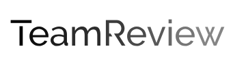

## Description

TeamReview is my first project in Flask, inspired by my wife's request for document reviews. The goal was to create a user-friendly website where individuals can log reviews and provide comments on documents. The project is built on the foundation of the [Flaskex](https://github.com/anfederico/flaskex), utilizing [Bulma CSS Framework](https://bulma.io/) for the frontend. The treeview feature is implemented using the W3 File Directory Treeview [example](https://www.w3.org/WAI/ARIA/apg/patterns/treeview/examples/treeview-1a/). For displaying code on the website, [Prism.js](https://prismjs.com/) has been integrated to the project.


Feel free to further customize the content to better suit your preferences and provide any additional details about your project.

## Installation

To run this Python Flask app locally, follow these steps:

    ```bash
    git clone https://github.com/beratatmaca/TeamReview.git
    cd TeamReview
    python -m venv venv
    source venv/bin/activate
    pip install -r requirements.txt
    export FLASK_APP=app
    flask run
    ```

Open your web browser and navigate to http://localhost:5000 to access TeamReview.

## License

This project is licensed under the [GNU General Public License (GPL)](LICENSE) - see the [LICENSE](LICENSE) file for details.


